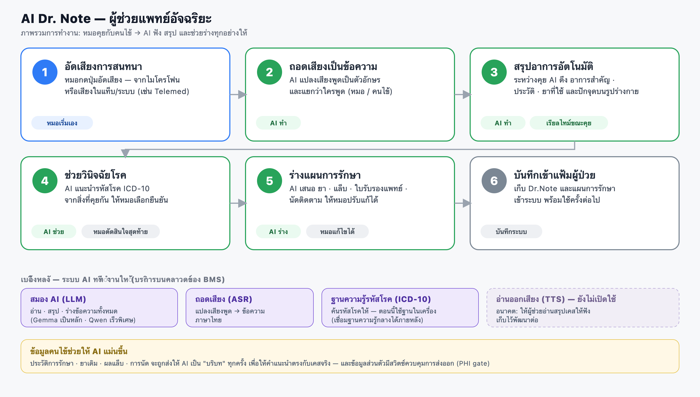
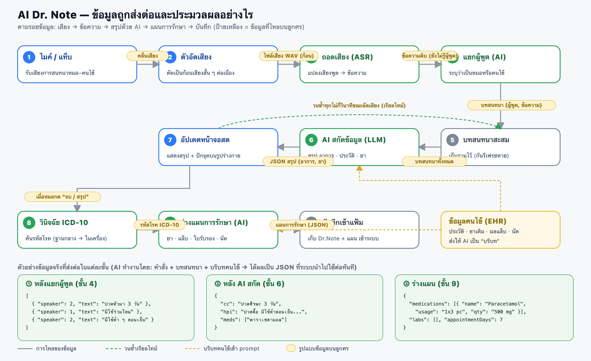
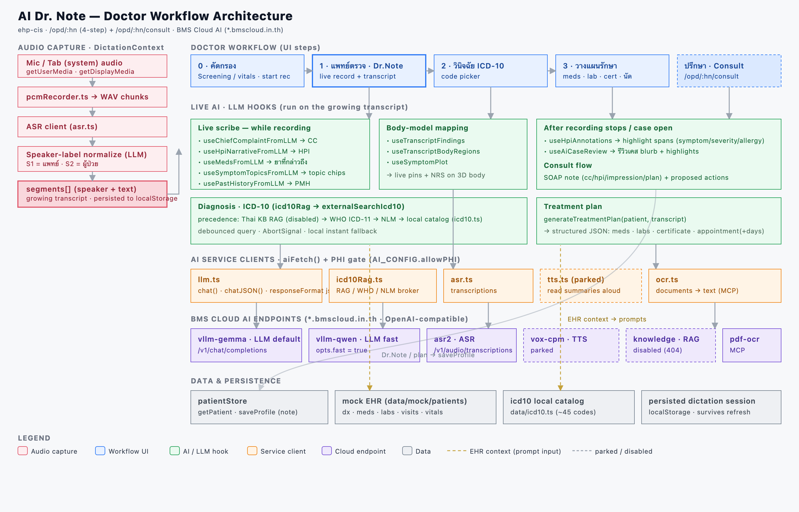

# AI Dr. Note — สถาปัตยกรรมผู้ช่วยแพทย์

เอกสารภาพรวมว่า **AI Dr. Note** ในขั้นตอนการทำงานของแพทย์ (`/opd/:hn` และ `/opd/:hn/consult`) ทำงานอย่างไร — ตั้งแต่อัดเสียงการสนทนา ไปจนถึงร่างแผนการรักษาและบันทึกเข้าแฟ้มผู้ป่วย

> รูปด้านล่างเป็น PNG (เพื่อให้แสดงผลถูกต้องบน GitHub) — ไฟล์ต้นฉบับ `.svg` แก้ไขได้อยู่ในโฟลเดอร์ [`docs/`](.)

---

## 1. ภาพรวมการทำงาน (เข้าใจง่าย)

ลำดับ 1→6 ตามที่แพทย์ใช้งานจริง

ไฟล์ต้นฉบับ: [`ai-dr-note-architecture-th.svg`](ai-dr-note-architecture-th.svg)

---

## 2. การส่งต่อและประมวลผลข้อมูล (Data Flow)

ตามรอยข้อมูล: เสียง → ข้อความ → สรุปด้วย AI → แผนการรักษา → บันทึก
พร้อมป้ายบอก **รูปแบบข้อมูลที่ไหลบนแต่ละลูกศร** และตัวอย่าง JSON จริง

- **เส้นประเขียว** = วงจรเรียลไทม์ (สรุปอัปเดตสดทุกไม่กี่วินาทีขณะอัดเสียง)
- **เส้นประเหลือง** = บริบทคนไข้ (EHR) ถูกฉีดเข้า prompt ของ AI
- หลักการ AI: **คำสั่ง + บทสนทนา + บริบทคนไข้ → ได้ JSON ที่ระบบนำไปใช้ต่อทันที**

ไฟล์ต้นฉบับ: [`ai-dr-note-dataflow-th.svg`](ai-dr-note-dataflow-th.svg)

---

## 3. สถาปัตยกรรมเชิงเทคนิค (Technical)

ชั้นต่าง ๆ ของระบบ: capture (DictationContext) · live LLM hooks · service clients · BMS Cloud endpoints · data/persistence

ไฟล์ต้นฉบับ: [`ai-dr-note-architecture.svg`](ai-dr-note-architecture.svg)

---

## บริการ AI เบื้องหลัง (BMS Cloud · `*.bmscloud.in.th`)

| บริการ | หน้าที่ | สถานะ |
|---|---|---|
| `vllm-gemma` / `vllm-qwen` | สมอง AI (LLM) — อ่าน/สรุป/ร่าง | ใช้งาน (gemma หลัก, qwen เร็วพิเศษ) |
| `asr2` | ถอดเสียง (ASR) เสียง→ข้อความ | ใช้งาน |
| `knowledge` | ฐานความรู้รหัสโรค (RAG, ICD-10-TM) | ปิดอยู่ — ใช้ฐานในเครื่อง `data/icd10.ts` |
| `vox-cpm` | อ่านออกเสียง (TTS) | พักไว้ ยังไม่เชื่อม |
| `pdf-ocr-mcp` | OCR เอกสาร | ใช้งาน (MCP) |

> ข้อมูลส่วนตัวคนไข้ (PHI) ส่งออกผ่านสวิตช์ควบคุม `AI_CONFIG.allowPHI` (`VITE_AI_ALLOW_PHI`)

## โค้ดที่เกี่ยวข้อง

- หน้า workflow: [`src/components/PatientOPD/index.tsx`](../src/components/PatientOPD/index.tsx)
- หน้าปรึกษา: [`src/components/PatientOPD/DrNoteConsult.tsx`](../src/components/PatientOPD/DrNoteConsult.tsx)
- ถอดเสียง/แยกผู้พูด: [`src/contexts/DictationContext.tsx`](../src/contexts/DictationContext.tsx)
- LLM client: [`src/services/ai/llm.ts`](../src/services/ai/llm.ts) · config: [`src/services/ai/config.ts`](../src/services/ai/config.ts)
- ICD-10: [`src/services/ai/icd10Rag.ts`](../src/services/ai/icd10Rag.ts)
